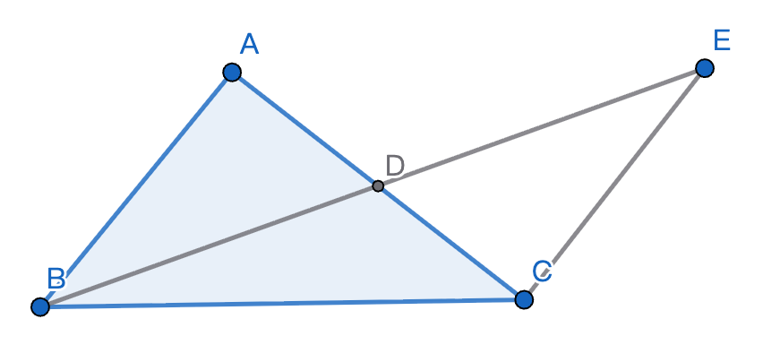

# 2026-01-11 學習日誌：數學

- [x] Google AI 推薦个 MathJax / $\LaTeX$ 線頂排版器
- [x] 複習「用平行公設證明三角形內角和180」
- [x] 反證法个本質就是證明 $\lnot Q \to \ \lnot P$ 為真

## Google AI 推薦个 MathJax / $\LaTeX$ 線頂排版器

- 新手/偶爾使用： 推薦 LaTeX Live（極致即即預覽）。
- 需要符號面板與繪圖： 推薦 Mathcha。
- 撰寫長篇筆記： 推薦 HackMD（文件與筆記整合）。

其他閣有 StackEdit（純粹个預覽工具）、LiveTeX Math (Figma
Plugin)（針對設計與協作）。

## 複習「用平行公設證明三角形內角和180」

【平行公設】定義：通過直線外一點，會使而且干焦會使做出一條佮迄條線平行个直線。
（Fairplay 版本）

證明：

作 $\triangle ABC$，過頂點 A 做對邊 $\overline{AB}$ 个平行線 $\ell$。
照【平行公設】，這平行線存在且唯一。

照【兩平行線，內錯角相等】：
$$
\angle(\ell, AB) = \angle B, \quad \angle(\ell, AC) = \angle C, \\
\therefore \quad \angle(\ell, AB) + \angle BAC + \angle(\ell, AC) = \angle B + \angle A + \angle C = 180\degree
$$

### 反證法證明【兩平行線，內錯角相等】

問題：

直線 AB 與直線 CD 平行，T 為其截線，分別交兩平行線於 E, F 兩點。
將 $\angle AEF$ 叫做 $\angle 1$，$\angle BEF$ 叫做 $\angle 2$；$\angle EFC$ 叫
$\angle 3$，$\angle EFD$ 叫做 $\angle 4$。$\angle 1$ 佮 $\angle4$ 互為內錯角；
$\angle 2$ 佮 $\angle 3$ 也是互為內錯角。

試證 $\angle 1 = \angle 4 \wedge \angle 2 = \angle 3$

證明：

先假設 $\angle 1 \neq \angle 4$，根據〔複製角度基本作圖法〕，
咱會使做出一條通過 E 點个直線 GH，使得 $\angle GEF= \angle 4$。

$\because$【內錯角相等，則兩線平行】$\quad \therefore$ 直線 $GH \| CD$

致使有兩條相異直線 AB 佮 GH 攏通過 E 而且佮 CD 平行，違背【平行公設】所講，
即種直線干焦有一條。咱个假設會推出錯誤結論，所以假設錯誤。反之才著：
$\angle 1 = \angle 4$。

### 反證法證明「內錯角相等，則兩線平行」

已知條件：直線 L 分別截兩直線 AB 佮 CD 於 E, F 兩點，
所形成个內錯角 $\angle AEF$ 佮 $\angle EFD$ 平大。

先假設 $\overleftrightarrow{AB} \nparallel \overleftrightarrow{CD}$，
按呢兩條線就會相交，令相交點為 G，按呢就會形成一个三角形 $\triangle EFG$。

對 $\triangle EFG$ 來講，$\angle AEF$ 是伊个外角，根據【外角定理】
（三角形个外角大於不相鄰个兩个內對角个任何一个），所以
$\angle AEF \gt \angle EFG = \angle EFD$，佮前提矛盾。所以
$\overleftrightarrow{AB} \| \overleftrightarrow{CD}$。

### 證明【三角形个外角定理】（用著對頂角相等、SAS）

問題：證明三角形个外角比伊無相鄰个兩个內對角个任何一个攏較大

有一个 $\triangle ABC$，延伸 BC 到 D，形成一个外角 $\angle ACD$，
咱欲證明 $\angle ACD > \angle BAC \ \wedge \ \angle ACD > \angle CBA$。

取 AC 个中點 E，使得 $\overline{AE} = \overline{EC}$，
作$\overrightarrow{BE}$，並且延伸到 F 點，使得 $\overline{BE} = \overline{EF}$。
閣來連接 $\overline{FC}$，形成三角形 $\triangle CEF$。
$\angle AEB$ 佮 $\angle CEF$ 是【對頂角相等】。
就按呢，照【SAS 全等定理】，$\triangle CEF \cong \triangle AEB$，
所以 $\angle BAC = \angle ECF$。

由圖中咱知，$\angle ECF$ 只是 $\angle ACD$ 个一部份，後者（整體）必然大過前者
（部份），所以 $\angle ACD > \angle ECF = \angle BAC$，所以
$\angle ACD > \angle BAC$。

閣來，咱踮 BC 即邊，嘛取中點做親像頂面个操作，就會使證明
$\angle ACD > \angle ABC$。

### 歐氏幾何个嚴密性

1. 【整體大過部份】、【SAS定理（公理）】、【對頂角相等定理】$\implies$
   【外角定理】（命題16）。

2. 命題16 $\implies$【內錯角相等則平行】（命題27）。（用反證法）

3. 命題27 + 平行公理 $\implies$【平行則內錯角相等】（命題29）。（用反證法）

4. 命題29 $\implies$【三角形三內角和 = $180\degree$】。

[Google AI 連結](https://share.google/aimode/RMNEoZzZgKffQM86o)

## 反證法个本質

用形式邏則个觀點來講，就是若欲直接證明「若 P 則 Q」歹剃頭个時，就改證明佮伊
同價个逆反命題「若非Q 則非P」，後者若證明成立，前者也必然成立。
