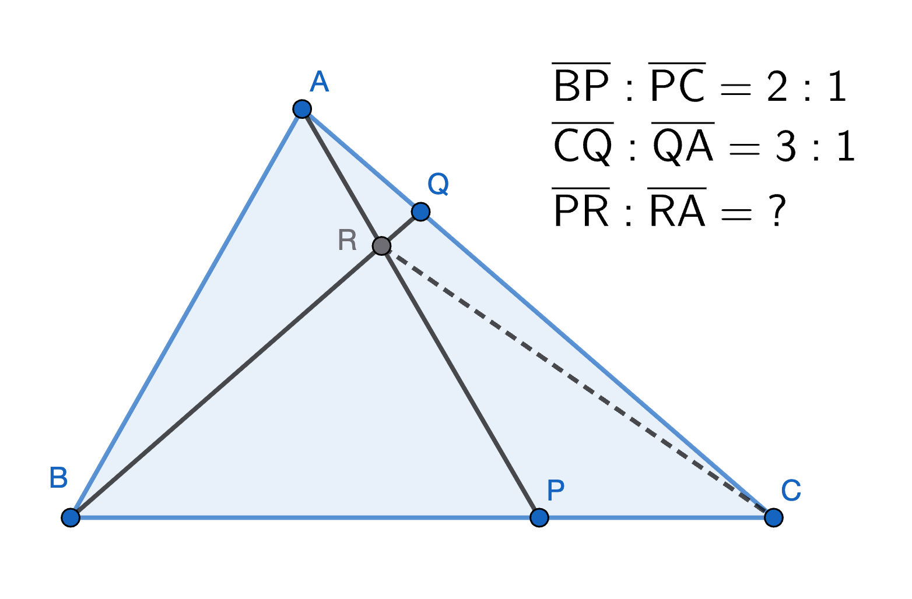

# 2026-01-14 學習日誌：數學

- [x] 「共高定理」vs「共邊定理」

## 「共高定理」vs「共邊定理」只是三角形面積公式个「退化版」个兩面相

三角形面積是「底邊 * 高 * 1/2」，一旦兩个三角形「高」平長，怹个面積比自然就會使
簡化做是「底邊个比」；兩个三角形若「底邊」平長，怹个面積比就是「高个比」。
這就是「共高定理」佮「共邊定理」个宗旨佮關係。

簡單講：

- 「共高定理」就是「共高个時，三角形面積比就是底邊比」
- 「共邊定理」就是「共邊个時，三角形想積比就是高長比」

《一線串通的初等數學》將共邊定理當中个「高長比」轉換做「斜邊比」，閣無講出頂面个
本質，予讀者較僫保握。

## 一線串通  習題 1.5

題目：點 P 在三角形 ABC 的 BC 邊上，使得 BP = 2PC；點 Q 在三角形 ABC 的 AC 邊上，使得 CQ = 3QA；
線段 AP 和 BQ 相交於 R；試用共高定理和共邊定理計算比值 PR / RA。

原題無圖，以下个圖是我用 Geogebra 畫个，解題關鍵是輔助線 RC。我家己想無，試幾若套 AI，
包括 ChatGPT、Warp AI、Gemini、Wolfram Alpha 攏烏白做，甚至拒絕做。後來揣著
https://math-gpt.org/ 才真正會曉解。

令 $|\triangle PCR| = y$，因為 $\triangle BPR$ 佮 $\triangle PCR$ 共高，所以

$$|\triangle BPR|:|\triangle PCR|=BP:PC=2:1 \\
\therefore |\triangle BPR|=2y$$

閣因為 $\triangle BRA$ 佮 $\triangle BCR$ 共邊 BR，所以

$$ |\triangle BRA| : |\triangle BCR| = AQ : QC = 1 : 3 \\
|\triangle BCR| = |\triangle BPR| + |\triangle PCR| = 2y+y = 3y \\
\therefore |\triangle BRA|=y$$

因為 $\triangle BRA$ 佮 $\triangle BPR$ 等高，所以

$${|\triangle BPR| \over |\triangle BRA|} = {PR \over RA} = 2y : y = 2 : 1$$
