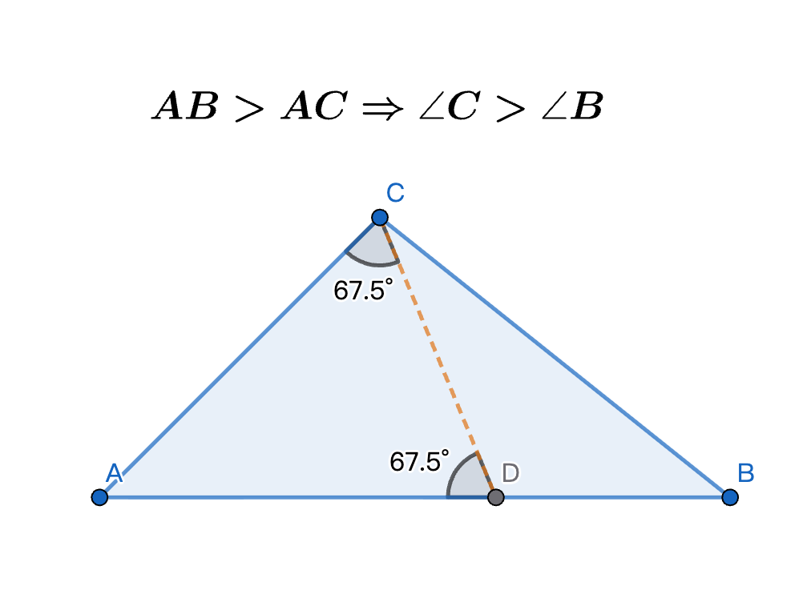
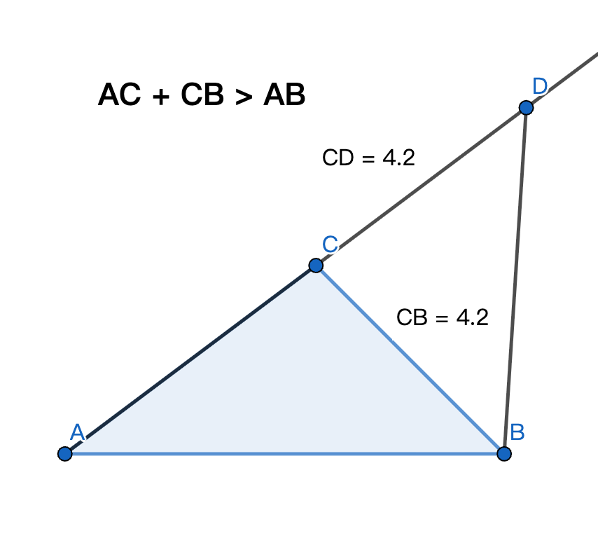
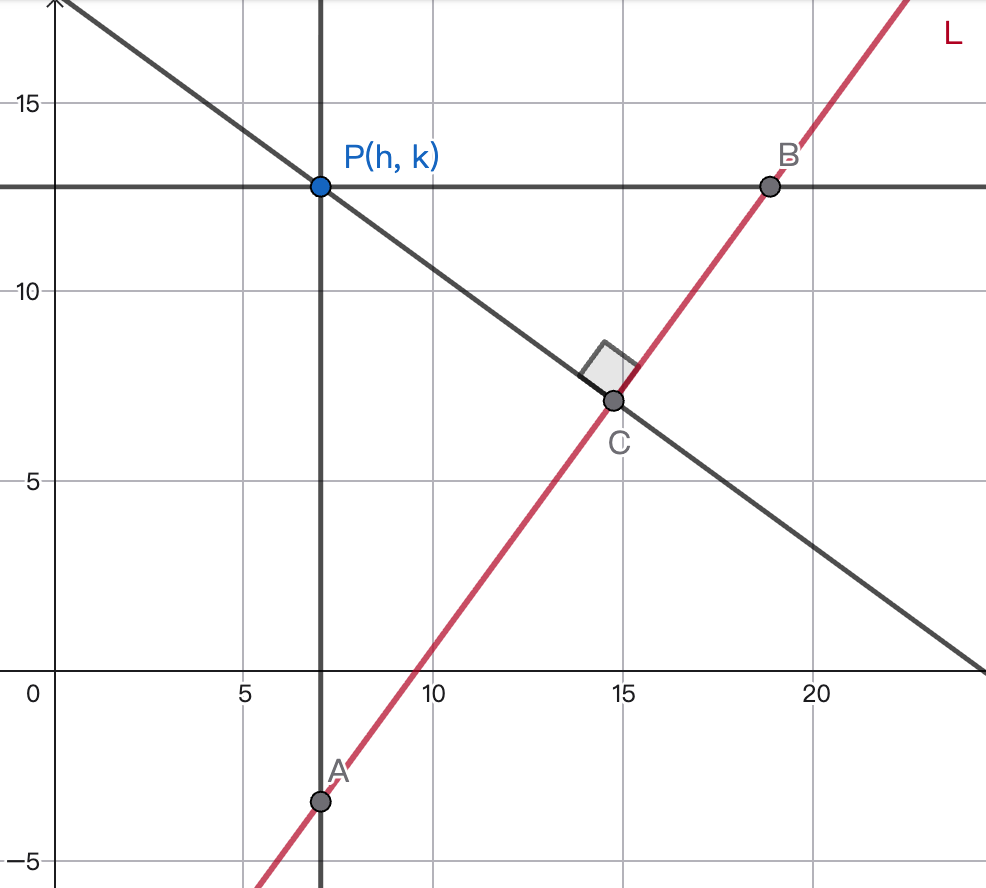

# 2026-02-03 學習日誌：數學

- [x] 三角形基本性質个證明
- [x] 一點到一線个距離公式
- [x] 圓外一點到圓个外切線个直線方程式

今仔日tshân-tshân豆干切-\-五角，去 math-gpt.org 註文一年份，有優待，開欲兩千箍。
今著穩心仔共伊問問題，毋免佇 Google AI、ChatGPT 遐走來走去。

## 三角形基本性質个證明

問一寡三角形基本性質个證明，拄好我問个順序，就是伊證明个順序：
https://math-gpt.org/chat/311d9eca-8179-4123-97db-dcd3e42fa430

1. 先證明大邊對大角
2. 閣證明大角對大邊
3. 就會使證明兩邊和大於第三邊
4. 連帶證明出兩邊差小於第三邊

以下是我个摘要：

1. 證明三角形大邊對大角：設使 AB > AC，欲證 $\angle C > \angle B$，就佇 AB
   取一點 D 予 AD = AC，按呢閣用

     1. 全體大於部份。
     2. 等腰三角形，兩底角平大。
     3. 三角形外角大於兩个內對角任何一个。

   即三項定律，就知影 $\angle ACB > \angle ACD = \angle ADC > \angle ABC\quad
   \therefore \angle C > \angle B$。

   

2. 證明三角形大角對大邊：用三一律證明。條件：$\angle C > \angle B$，則：

   1. AB < AC ? 頭前有證大邊對大角，假使 AB < AC，則 C > B，無合。
   2. AB = AC ? 按呢 ABC 是等腰三角形，C = B，無合。
   3. 只賰 AB > AC 一種可能性。

3. 證明三角形 ABC 兩邊和大於第三邊：

   - 直觀證明：兩點之間，直線上短。所以 AC + CB > AB
   - 用大角對大邊來證明：延伸 AC 到 D 予 CD = BC  
     $\angle ABD > \angle CBD = \angle CDB$，大角對大邊，所以 AD = AC + CB > AB

   

4. 證明三角形 ABC 兩邊差小於第三邊：對頭前个結果簡單推論出：
$$
AB + BC > CA \implies CA - AB < BC \land CA - BC < AB \\
BC + CA > AB \implies AB - BC < CA \land AB - CA < BC \\
CA + AB > BC \implies BC - CA < AB \land BC -AB < CA
$$

## 一點到一線个距離公式：$P(h,k)$ 到 $ax + by + c = 0$ 个距離

用解析幾何法：

1. 假使直線是垂線 $x = \alpha$，按呢點到線个距離是 $|h-\alpha|$
2. 假使直線是水平線 $y = \beta$，按呢點到線个距離是 $|k-\beta|$
3. 假使直線是斜線$L: ax + by + c = 0$，如圖，求點$P(h,k)$到線L个距離，即个距離
   就是指對點到線做垂直線段 PC 个長度。

通過 P 做一條水平線佮一條垂直線，垂直線交 L 佇 $A(h, y_A)$，水平線交 L 佇
$B(x_B, k)$。點A、點B 分別代入線L：

$$
ah + by_A + c = 0 \implies y_A = (-ah - c)/b \quad\therefore A=(h, (-ah-c)/b) \\
ax_B + bk + c = 0 \implies x_B = (-bk - c)/a \quad\therefore B=((-bk-c)/a, k)
$$

$$
\overline{PA} = \left|k - \frac{-ah-c}{b}\right| = \left|\frac{ah + bk + c}{b}\right| \\
\overline{PB} = \left|h - \frac{-bk-c}{a}\right| = \left|\frac{ah + bk + c}{a}\right| \\
$$
令 $N = |ah + bk + c|$，則$\displaystyle\overline{PA}=\frac{N}{|b|},\ \overline{PB}=\frac{N}{|a|}$。

$$\begin{aligned}
\overline{AB}
&= \sqrt{(h-\frac{-bk-c}{a})^2 +(k-\frac{-ah-c}{b})^2} \\
&= \sqrt{(\frac{ah+bk+c}{a})^2+(\frac{bk+ah+c}{b})^2} \\
&= \sqrt{\frac{N^2}{a^2}+\frac{N^2}{b^2}} \\
&= \frac{N}{|ab|}\sqrt{a^2 + b^2}
\end{aligned}
$$

$$
\because 2 \times \triangle PAB = \overline{PA} \times \overline{PB}
= \overline{AB} \times \overline{PC} \\
\therefore \frac{N}{|b|} \times \frac{N}{|a|} = \overline{PC} \times
\frac{N}{|ab|}\sqrt{a^2+b^2} \\
\overline{PC} = {N \over \sqrt{a^2+b^2}}
$$
$$
{|ah+bk+c| \over \sqrt{a^2+b^2}} \quad 即所求个點到線个距離。
$$

## 兩條平行線个距離公式

對頂節个結果進一步推導出兩平行線距離公式。先設兩條平行線是：

$$\begin{cases}
ax + by + c1 = 0 & \text{(1)}\\
ax + by + c2 = 0 & \text{(2)}
\end{cases}
$$

(1) 佮 Y 軸交於 $(0, -c1/b)$，選用即點到 (2) 个距離即所求，今套用點到線距離公式：
$$
{ |a\cdot 0 + b\cdot \frac{-c1}{b} + c2| \over \sqrt{a^2+b^2} } =
{ |c1-c2| \over \sqrt{a^2+b^2} }
$$

## 圓外一點到圓个兩條切線个直線方程式

圓外一點 $P(x_0, y_0)$，圓方程式 $(x-h)^2 + (y-k)^2 = r^2$，也就是圓心 $(h,k)$，
半徑 $r$。求 $P$ 對圓个兩條切線方程式。

閣令切線方程式个斜率是 m，所以切線方程式用點斜式表示就是 $(y-y_0) = m(x-x_0)$，
整理了後是 $mx - y + (y_0 - mx_0) = 0$

圓心到切線个距離等於半徑。以下等式解出 m 个兩根代入直線式就可以。

$$ { |mh - k + y_0 - mx_0| \over \sqrt{m^2+1} } = r $$

[Google AI 摘要](https://share.google/aimode/FsJrf0XDLGjp01uTN)：

推導圓外一點對圓的切線方程式，主要步驟為：

1. 設切線為 $y-y_{0}=m(x-x_{0})$。
2. 利用點到直線距離公式 $\dfrac{|mh-k+y_{0}-mx_{0}|}{\sqrt{m^{2}+1}}=r$
   建立等式。
3. 平方並解出 $m$ 的兩個解（若僅一解則補上鉛直線 $x = x_0$）。
4. 將 $m$ 代回點斜式即可得到兩條切線方程式。

