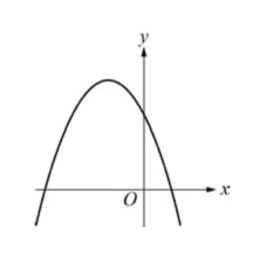
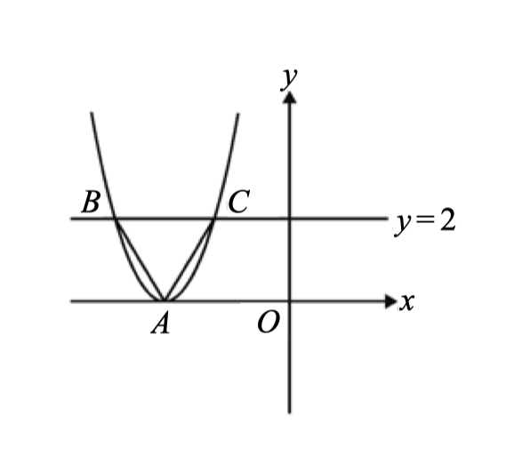

# 2026-02-20 學習日誌：數學

- [x] 完成南一高中數學銜接教材_單元6：二次函數

## 南一高中數學銜接教材_單元6：二次函數

### 係數判別

已知二次函數 y = ax² + bx + c 个圖形如上，判別 a, b, c 佮 b²-4ac 个正負

- a: 開口向下，則 a < 0
- b: 頂點 x 坐標 $\dfrac{-b}{2a}$ < 0，∴ b < 0
- c: x = 0 个時，y = c，∴ c 就是 y 截距，如圖，c > 0
- 圖形交 x 軸佇兩點，∴ 有兩个實根，b² - 4ac > 0

### 利用正三角形邊、高比例求二次函數个係數佮 y 截距

如上圖，坐標平面頂有一个頂點是 A 个拋物線，伊佮方程式 y = 2 个圖形
交佇 B、C 兩點，而且 $\triangle ABC$ 是正三角形。若 A 點坐標是 (-3, 0)，按呢即條
拋物線佮 y 軸个交點坐標是啥？

解方：頂點是 (-3, 0)，套入二次函數頂點 $y = a(x - h)^2 + k$：

$$\begin{aligned}
y &= a(x - (-3))^2 + 0 \\
y &= a(x+3)^2 \quad\dots\text{(1)}
\end{aligned}
$$

干焦一个係數愛閣算，咱只要求出 C 或 B 个坐標，代入式內，算出 a，就有完整个二次
函數，閣用 0 代入 x，就是所求个 y 截距。

ABC 連做一个正三角形，所以對 A 向 BC 做垂線（其實也是中線）就是高 h
（垂足定做 D），因為 BC 佇 y = 2 線頂，所以高 h (=AD) 就是 2。直角三角形 ADC 中，
AD 是 60 度對邊，DC 是 30 度對邊，所以

$$
AD: DC = 2 : DC = \sqrt3 : 1 \implies DC = \frac{2}{\sqrt3}
$$

D 點个 $x$ 坐標 = A 點个 $x$ 坐標 = -3，C 點个 $x$ 坐標 =
$-3 + \frac{2}{\sqrt3}$、 $y$ 坐標 = 2，代入 (1) 式：

$$\begin{aligned}
2 &= a(-3 + \frac{2}{\sqrt3} + 3)^2 \\
2 &= a(\frac{2}{\sqrt3})^2 \\
a &= \frac32
\end{aligned}$$

所以本題个二次函數就是 $y = \frac32(x + 3)^2$，伊个 y 截距就是 $\frac{27}{2}$。
答案： $(0, \frac{27}{2})$。

