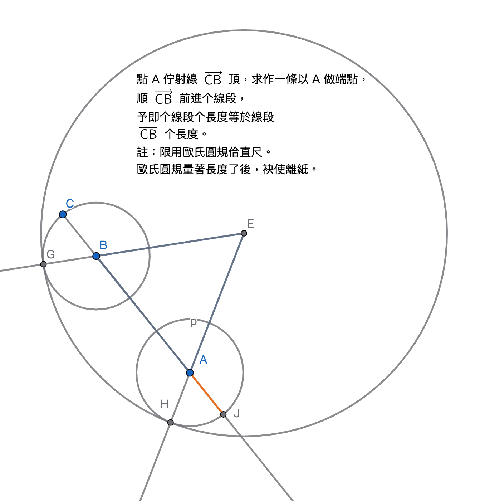

# 2026-02-26 學習日誌：台語、數學

## 英文詞台語試譯

### trivial => 碎微

我想著會使將 "trivial" 譯做【碎微 tshuì-bî】，音、義攏有譯著。"trivial case"
就是「碎微个khè-suh」。

## 幾何原本回春

即兩工讀 *Euclid's Elements Redux*，伊个習題不止仔予儂費心神，毋是簡單个複習
性質。

### Proposition 1.1 等邊三角形做圖

Exercise 5 (p.34) 問 math-gpt 才會曉。

### Proposition 1.2 端點畫線段

> Given an arbitrary point and an arbitrary segment, it is possible to construct
> a segment with:
>
> (1) one endpoint being the previously given point
>
> (2) a length equal to that of the arbitrary segment.

Euclid 作圖所用个圓規有特別限制：圓規量取長度了後，干焦會使就地畫圓，袂使提起來
飛過去別位，若無，所量个長度就無去矣。所以才著設本題即類个題目來挑戰。

正文示範个是點佇線段外个情形，抑習題要求个是點佇線段頂个情形。今總共有以下幾種
情形，畫法原理相通，但是有無仝个鋩角：

1. 點佇線段外，佮線段無共線。（正文）
2. 點佗線段外，佮線段个延伸線共線。
3. 點佇線段頂，但是點毋是線段个端點。（習題，解答用著 2.）
4. 點是線段个端點之一。

第 1 種情形个做法，看 p.35-6。第 3 種情形个解答看 p.484，第 4 種情形是 sap-á
情形（trivial case）。以下是第 2 種个做圖法：

1. 用 B 做圓心，BC 做半徑畫圓 $\odot B$。
2. 用 AB 做底邊，做一个等邊三角形（等邊三角形做法看 Prop.1.1）。
3. 延伸 $\overrightarrow{EB}$ 交 1. 个圓佇 G 點。
4. 用 E 做圓心，EG 做半徑畫圓。
5. 延伸 $\overrightarrow{EA}$ 交 4. 个圓佇 H 點。
6. 用 A 做圓心，AH 做半徑畫圓。
7. 延伸 $\overrightarrow{CA}$ 交 6. 个圓佇 J 點。$\overline{AJ}$ 是咱所求。

#### Proposition 1.2 个重要性

因為歐氏圓規袂使得離紙閣保持開跤度，但是量取長度去別位應用閣非常重要閣捷用，
舉例像「畫平行線」就愛用著，所以本做圖法就常在會出現。總是，目前个幾何學教學
無咧管這，攏假定圓規離紙無要緊矣。

