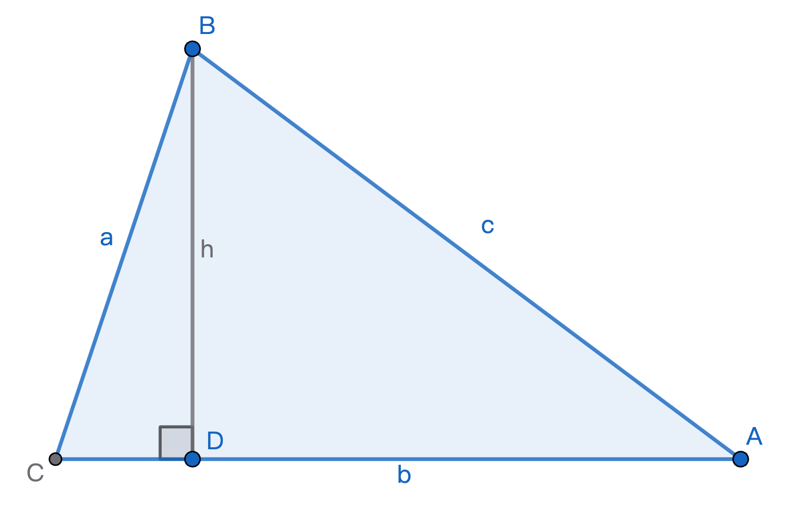

# 2026-03-03 學習日誌：數學

## 幾何基本性質个命題佮逆命題

幾何基本性質个命題佮逆命題有真濟攏同齊成立，親像：

1. 若內錯角相等，則兩線平行。vs. 若兩線平行，則內錯角相等。

2. 三角形大邊對應大角。vs. 三角形大角對應大邊。

3. 等腰三角形兩底角相等。vs. 兩底角相等个三角形等腰。

4. 三角形若是直角三角形，則斜邊 c² = a² + b²。vs. 三角形大邊 c² = a² + b²，則
   三角形是直角三角形。

其中第 4. 點是我看著 *Euclid's Elements Redux* 个 Book I 最後个兩个命題才智覺得
我四十幾年來攏無去想著迄个畢氏定理个逆命題个成立佮證明个問題。一方面是阮个數學
教育兩光兩光，一方面是我家己無用心。

以上个逆命題欲證明，攏是先證明順命題，才閣用歸謬證法來證明逆命題也成立，而且往往
有用「檢討法」來排除無可能个情形，佇歸謬證法證明个過程中，時常用著順命題已經建立
个定理。

## 畢氏定理逆命題證明

以下是我家己想个證法：

$\triangle ABC$ 三邊長為 a, b, c，若 $c^2=a^2+b^2$，則 $\angle
C = 90^\circ$。

證明：

大方向：用檢討式三一律反證法，過程中愛利用進前已經證明个順命題：直角三角形斜邊个平方
等於兩股个平方和。

$\angle C$ 只有三種情形：小於、等於、大於直角：

1. 如圖，假使 $\angle C < 90^\circ$，因為前提條件是

   $$
   c^2=a^2+b^2 \quad\cdots\text{(1)}
   $$

   可見 $c$ 是上長个邊，對應个 $\angle C$ 是上大个角，連上大个角都較細90度，
   可見 $\triangle ABC$ 是銳角三角形，所以咱會使對點 B 做一條垂線 $\overline{BD}$
   交 $b$ 於點 D。$\triangle BDA,\ \triangle BDC$ 攏是直角三角形，令
   $\overline{BD} = h,\ \overline{CD} = d$，按呢 $h,\ d > 0$，依畢氏定理順命題：

   $$\begin{aligned}
   a^2 &= h^2+d^2 &\quad\cdots\text{(2)} \\
   c^2 &= h^2+(b-d)^2 &\quad\cdots\text{(3)}
   \end{aligned}$$

   綜合 $(1)$ 佮 $(2)$ 得著：
   $$\begin{aligned}
   c^2 &= h^2 + d^2 + b^2 \quad\cdots\text{(4)}
   \end{aligned}$$

   $(4) - (3)$ 得著：
   $$\begin{aligned}
   0 = 2bd \implies d = 0
   \end{aligned}
   $$

   佮 $d > 0$ 矛盾，所以假設 $\angle C < 90^\circ$ 袂成立。

2. 假設 $\angle C > 90^\circ$，類似證法證明即條假設袂成立。

3. 只賰 $\angle C = 90^\circ$ 一種可能性，得證。

補充：我頭前講「反證法」是歧義用語，一方面指三一律當中，已經透過證明過程來排除
其中兩个，就有夠額「反證」最後一種可能性是真，按呢最後迄種可能性就免閣提出證明。
另外一方面。「反證法」也指「歸謬證法」，用佇排除前兩種可能性个證明个過程內部，
假設个前提佮推理个結果矛盾，來「反證」假設是錯誤。
