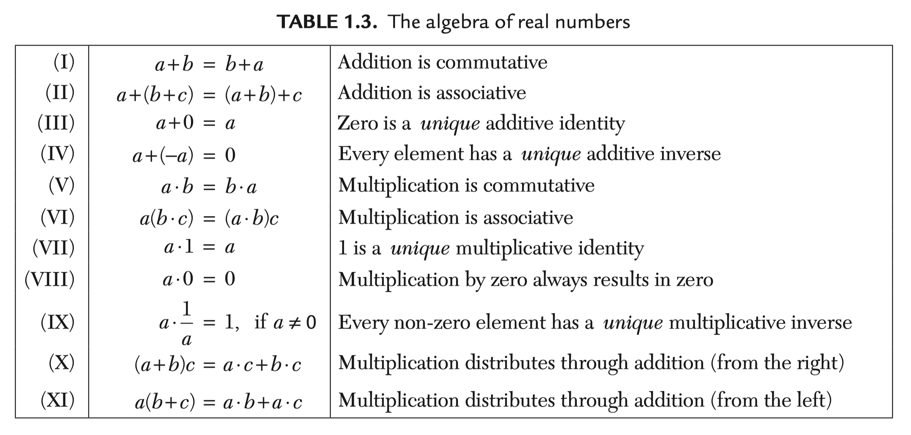

# 2026-03-09 學習日誌：數學

我叫 math-gpt 列出實數體所有个公理：
https://math-gpt.org/chat/f6bc2cf3-3434-4e4b-92c7-c0c1a209c814

---

## 實數體公理

實數體 $\mathbb{R}$ 的定義非常嚴謹，它必須完整滿足三組公理：
**代數公理（體公理）**、**順序公理** 以及最關鍵的 **完備性公理**。

我們可以把這想像成一個數字系統必須遵守的「遊戲規則」。

### 一、 代數公理 (Field Axioms)

這組公理保證了我們可以自由地進行加、減、乘、除。對於 $\mathbb{R}$ 中的任意元素 $a, b, c$：

#### 1. 加法性質

*   **封閉性**： $a + b$ 也是實數。
*   **交換律**： $a + b = b + a$。
*   **結合律**： $(a + b) + c = a + (b + c)$。
*   **單位元**：存在一個實數 $0$，使得 $a + 0 = a$。
*   **反元素**：每個實數 $a$ 都有一個對應的 $-a$，使得 $a + (-a) = 0$。

#### 2. 乘法性質

*   **封閉性**： $a \cdot b$ 也是實數。
*   **交換律**： $a \cdot b = b \cdot a$。
*   **結合律**： $(a \cdot b) \cdot c = a \cdot (b \cdot c)$。
*   **單位元**：存在一個實數 $1$ (且 $1 \neq 0$)，使得 $a \cdot 1 = a$。
*   **反元素**：對於每個不為 $0$ 的實數 $a$，都存在一個 $\frac{1}{a}$，使得 $a \cdot \frac{1}{a} = 1$。

#### 3. 分配律
*   $a \cdot (b + c) = (a \cdot b) + (a \cdot c)$。

### 二、 順序公理 (Order Axioms)
這組公理定義了數字的大小關係（即「$>$」符號）。對於 $\mathbb{R}$ 中的任意元素 $a, b, c$：

1.  **三一律**： $a > b$、 $a < b$ 或 $a = b$ 三者之中，恰好只有一個成立。
2.  **遞移律**：若 $a > b$ 且 $b > c$，則 $a > c$。
3.  **加法單調性**：若 $a > b$，則 $a + c > b + c$。
4.  **乘法單調性**：若 $a > b$ 且 $c > 0$，則 $a \cdot c > b \cdot c$。

滿足以上兩組公理的系統稱為**有序體 (Ordered Field)**。有理數 $\mathbb{Q}$ 也符合這兩組公理。

### 三、 完備性公理 (Completeness Axiom)

這是實數體最特別的地方，也是它與有理數體最大的區別。它保證了數線上是「實心」的，
沒有任何漏洞。

* **戴德金完備性 (Least Upper Bound Property)**：
  > 任何一個有上界的非空實數集合，必定存在一個**最小上界 (Supremum)**。

**白話解釋：**  
如果你有一群數字（集合），而且這群數字都有一個天花板（上界），那麼在這個天花板
之下，一定可以找到一個「最貼近這群數字的精確天花板」。

例如，有理數系統中，數列 $1, 1.4, 1.41, 1.414, \dots$ 的平方越來越接近 $2$，
但在有理數裡找不到 $\sqrt{2}$。實數體的完備性公理補齊了這些「洞」，
確保像 $\sqrt{2}$ 或 $\pi$ 這樣的數確實存在於系統中。

### 總結

當一個集合滿足了：
1.  **代數公理**（可以算）
2.  **順序公理**（可以比大小）
3.  **完備性公理**（沒有漏洞）

我們就稱這個系統為 **完備有序體 (Complete Ordered Field)**，這就是**實數體**的
嚴格定義。

---

## 檢討 FOM 个實數體公理

即兩工所用个 Foundations of Math 內底个實數體代數公理表，其中 (VIII) a·0 = 0
會使得用別條公理佮等量公理推導出來，閣最後兩條分配律會使合做一條。另外，我看著
Youtube 一段影片將 $1 \ne 0$ 列做公理，這愛閣了解一下。

以下繼續練習干焦倚靠實數體公理來做證明實數个一寡基本運算。我攏無去用著
無屬佇實數體公理个等量公理。若 *FOM* 个證法就不時用著等量公理，設左式為 x
去推演，就愛用著等量公理。

### 求證 $\frac{b}{-a} = \frac{-b}{a} = -\frac{b}{a}$

**證明：**

$$\begin{aligned}
\frac{b}{-a} &= b \cdot \frac{1}{-a}\\
&= b \cdot \frac{1}{(-1)a}\\
&= b \cdot \frac{1}{-1} \cdot \frac{1}{a}  \quad\cdots\text{(1)}
\end{aligned}
$$

$\frac{1}{-1}$ 是 -1 个乘法反元素，另外一方面，咱已經證明 (-1)(-1) = 1，所以 -1
也是 -1 个乘法反元素，由反元素个唯一性，咱知影 $\frac{1}{-1} = -1$。所以，

$(1) \implies b\cdot(-1)\cdot\dfrac1a = (-1)b\cdot\dfrac1a \quad\cdots\text{(2)}$

$(2) \implies ((-1)b)\dfrac1a = \dfrac{-b}{a}$

$(2) \implies (-1)(b\cdot\dfrac1a) = (-1)\dfrac{b}{a} = -\dfrac{b}{a}$

先證即條通式了後，自然就會使得著特殊情形
a = b = 1 个時，$\frac{1}{-1}=\frac{-1}{1}=-\frac{1}{1}$。
嘛會使先證特式，才證通式：

1. 已證 (-1)a=-a，(-1)(-1) = 1，$\frac{a}{b}\cdot\frac{c}{d}=\frac{ac}{bd}$。

2. $\frac{1}{-1}$ 是 -1 个乘法反元素，另外一方面，(-1)(-1)=1，所以 -1 也是 -1
   个乘法反元素，所以 $\frac{1}{-1}=-1$。

3. $\frac{m}{m}=m\cdot\frac1m=1$，m 用 1 代，則 $\frac11=1$，m 用 -1 代，則
   $\frac{-1}{-1}=1$。

4. $\frac{1}{-1}=\frac{(-1)(-1)}{-1\cdot
   1}=\frac{-1}{-1}\cdot\frac{-1}{1}=1\cdot\frac{-1}{1}=\frac{-1}{1}$  
   或者是比較通式个證法：  
   $\frac{1}{-1}=1\cdot\frac1{-1}=\frac11\cdot -1=-1\cdot\frac11=\frac{-1}{1}$

5. $\frac{1}{-1}=-1=-1\cdot 1=-1\cdot\frac11=-\frac11$

所以 $\frac{1}{-1}=\frac{-1}{1}=-\frac11=-1$。

閣用以上特式證通式：

1. $\frac{b}{-a}=\frac{1\cdot b}{-1\cdot a}=\frac{1}{-1}\cdot\frac{b}{a}=
   \frac{-1}{1}\cdot\frac{b}{a}=\frac{-1\cdot b}{1\cdot a}=\frac{-b}{a}$

2. $\frac{b}{-a}=\frac{1}{-1}\cdot\frac{b}{a}=(-1)\frac{b}{a}=-\frac{b}{a}$

#### 以上證法个檢討

牽涉著分數運算，上好是先建立 $\dfrac{a}{b}\cdot\dfrac{c}{d}=\dfrac{ac}{bd}$
即分數乘法公式，了後就用這做基礎，來證明其他个分數等式。咱欲證明以上三種分數寫法
仝值，只要證明怹分別佮 $\dfrac{-a}{b}$ 相乘後是 1，自然就證明怹是仝迄个乘法反元素，
仝值。

$(1)\quad \dfrac{-a}{b}\cdot\dfrac{b}{-a}=\dfrac{-1\cdot a\cdot b}{b\cdot -1\cdot a} = 1$

$(2)\quad \dfrac{-a}{b}\cdot\dfrac{-b}{a}=\dfrac{(-1)a\cdot(-1)b}{b\cdot a} = 1$

$(3)\quad \dfrac{-a}{b}\cdot-\dfrac{b}{a}=-1\cdot\dfrac{-ab}{ba}=-1\cdot -ab\cdot\dfrac1{ab}
  =(-1)(-1)\cdot ab\cdot\dfrac1{ab}=1\cdot1=1$

